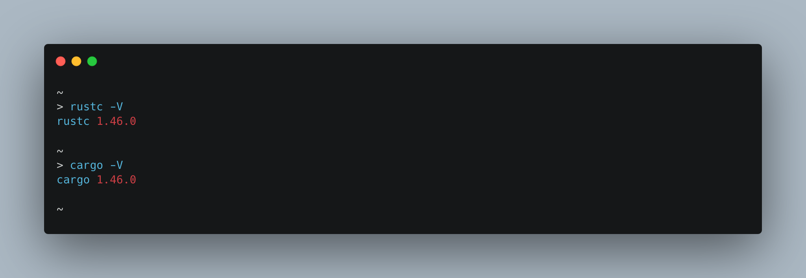
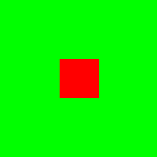

## Getting Started Spinning Square

Welcome to Piston tutorial! We're glad you are here 🤗

Piston is a modular open-source game engine that helps in developing 2D, 3D, and a lot of other things. You can learn more about Piston at the official [website](www.piston.rs).

The goal of this tutorial is to help you in building a sample game to test the built environment. As we walk through that process, we hope to get you from an empty Cargo project to having a window with a rotating square in it. 
The full tutorial is intended to be as accessible as possible to people without much Piston experience - you don’t need to be an expert. 

***Note: This tutorial does not explain concepts used in the game, as those will be covered by other tutorials.***

## Contents

- [**Prerequisites**](#prerequisites)
- [**Setting up the project**](#setting-up-the-project)
- [**Writing Code**](#writing-code)
- [**Compiling and running**](#compiling-and-running)
- [**What's Next**](#whats-next)

## Prerequisites: 

Before you start building your first game, you need to make sure that you have already installed [Rust and Cargo](https://doc.rust-lang.org/book/ch01-01-installation.html), and have already built a [hello-world project](https://doc.rust-lang.org/book/ch01-02-hello-world.html) with Cargo. 

If you haven’t done so, we recommend you to Install Rust and Cargo. You can follow up [this](https://doc.rust-lang.org/book/ch01-00-getting-started.html) guide

To check whether you have `Rust` and `Cargo` installed correctly, open a terminal and enter this:

```bash
rustc -V
```

```bash
cargo -V
```
The output should look similar to the screenshot below, showing version numbers in response to the commands.

<p align="center">

</p>

If you are getting some errors in either of these, please make sure that you have fulfilled [prerequisites](#prerequisites) and installed the latest versions of `rust` and `cargo`.

Parts of the Piston project depend on native C libraries. To display a window and hook it up to an OpenGL context, you can use either `Glutin`, `GLFW`, or `SDL2` as the implementation of the windowing system. Currently, in this tutorial, we are using `Glutin` for `windowing`, you don't have to install any additional libraries for now.

## Setting up the project: 

If everything is set up correctly, it's time to create a Cargo project, and specify dependencies.

In a terminal, type the following command:

```bash
cargo new --bin getting-started
```
This creates the folder we are going to work with, as well as an initial configuration for cargo.

Now, navigate to the directory: 

```bash
cd getting-started
```
Inside the folder, you will find it has created a file, `Cargo.toml` and a directory, named `src`. Inside `src`, you will find the `main.rs` file, with the basic rust "Hello World" program inside it.

Now in your favorite editor, tidy up the `Cargo.toml` file and create workspaces which include the project settings, packages, and all the required dependencies. 

```toml
[package]

name = "spinning-square"
version = "0.1.0"
authors = [
    "Sonia Singla <contact@soniasingla.in>"
]

[[bin]]
name = "spinning-square"

[dependencies]
piston = "0.52.0"
piston2d-graphics = "0.37.0"
pistoncore-glutin_window = "0.66.0"
piston2d-opengl_graphics = "0.74.0"
```

This section explains the information of our package which includes `name`, `version`, `author` and the required `dependencies`. It tells Cargo that our project will depend on `piston`, `piston2d-graphics`, `pistoncore-glutin_window`, and `piston2d-opengl_graphics`.

> Note: Make sure that you are using the same name for `[package-name]` and `[bin-name]`, otherwise you will find that the build will error when this is the case.

You may notice that this is a lot of dependencies for such a simple example application. This is because of how the Piston Projects are organized. The piston and graphics libraries can do a lot of work by themselves, but they are made to be completely independent of a backing implementation. 

For example, when it comes to displaying a window and getting keyboard events in a cross-platform manner, you can use either `Glutin`, `GLFW` or `SDL2`. `GLFW` and `SDL2` are both C and C++ cross-platform libraries for creating windows with an `OpenGL` context. In this tutorial, we chose `Glutin`, and you will notice that in the `cargo` file, we imported `glutin_window`. `opengl_graphics` is another backend that implements the interface defined in graphics. `graphics` is a 2d graphics API that doesn't care about how things are actually drawn to the screen. If you implement the graphics interface yourself, you could route it through `directx`, or render straight to a png. In this tutorial, we are rendering using `OpenGL`, so we'll use `opengl_graphics`.

The pattern of "interface" and "backend" is very common with Piston Projects. While other game engines might encompass lots of functionality, we prefer to have many libraries that are separate and extendable, but also work well when combined.

## Writing Code: 

Now open up `src/main.rs` in editor and paste the following code over the old one:

```rust
extern crate glutin_window;
extern crate graphics;
extern crate opengl_graphics;
extern crate piston;

use glutin_window::GlutinWindow as Window;
use opengl_graphics::{GlGraphics, OpenGL};
use piston::event_loop::{EventSettings, Events};
use piston::input::{RenderArgs, RenderEvent, UpdateArgs, UpdateEvent};
use piston::window::WindowSettings;

pub struct App {
    gl: GlGraphics, // OpenGL drawing backend.
    rotation: f64,  // Rotation for the square.
}

impl App {
    fn render(&mut self, args: &RenderArgs) {
        use graphics::*;

        const GREEN: [f32; 4] = [0.0, 1.0, 0.0, 1.0];
        const RED: [f32; 4] = [1.0, 0.0, 0.0, 1.0];

        let square = rectangle::square(0.0, 0.0, 50.0);
        let rotation = self.rotation;
        let (x, y) = (args.window_size[0] / 2.0, args.window_size[1] / 2.0);

        self.gl.draw(args.viewport(), |c, gl| {
            // Clear the screen.
            clear(GREEN, gl);

            let transform = c
                .transform
                .trans(x, y)
                .rot_rad(rotation)
                .trans(-25.0, -25.0);

            // Draw a box rotating around the middle of the screen.
            rectangle(RED, square, transform, gl);
        });
    }

    fn update(&mut self, args: &UpdateArgs) {
        // Rotate 2 radians per second.
        self.rotation += 2.0 * args.dt;
    }
}

fn main() {
    // Change this to OpenGL::V2_1 if not working.
    let opengl = OpenGL::V3_2;

    // Create an Glutin window.
    let mut window: Window = WindowSettings::new("spinning-square", [200, 200])
        .graphics_api(opengl)
        .exit_on_esc(true)
        .build()
        .unwrap();

    // Create a new game and run it.
    let mut app = App {
        gl: GlGraphics::new(opengl),
        rotation: 0.0,
    };

    let mut events = Events::new(EventSettings::new());
    while let Some(e) = events.next(&mut window) {
        if let Some(args) = e.render_args() {
            app.render(&args);
        }

        if let Some(args) = e.update_args() {
            app.update(&args);
        }
    }
}
```

Let’s walk through the code step by step for a better explanation:

In the main function, we have included the crate Window that bring its contents into the global namespace, by creating a window of  200x200 pixels named "spinning-square" and tell it to close when we press `esc` key.

Next, we draw our square, to do this we are calling function `fn render(&mut self, args: &RenderArgs)`.

To clear the screen in green color, we added `clear(GREEN, gl);`

Next, to draw the rotating box, we are using the function `rectangle(RED, square, transform, gl);`

After that, we have added an `update` function to rotate the square at the rate of 2 radians per second.

Voila! One last step, let’s create a production build and run the game 🎮

## Compiling And Running

Now that we have the game code ready, the next step is to run it with `Cargo`, download dependencies, and build the application.

To build the game, type:

```bash
cargo build
```
If everything goes fine, you should have the binary spinning-square inside the `target/debug` directory. 

Run it by executing 

```bash
cargo run
```
On your screen you should have a rotating square that looks like this:

<p align="center">

</p>

## Whats Next?

Take a look at the [piston-examples](https://github.com/pistondevelopers/piston-examples) repository.
